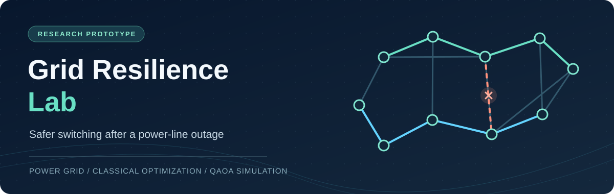
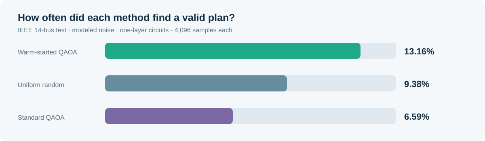

<div align="center">



# Can a quantum search find safer ways to reroute a stressed power grid?

**A reproducible simulation of grid switching after a transmission-line outage.**

[](https://www.python.org/)


[What this project does](#the-problem-in-plain-english) · [Results](#what-we-found) · [Run it](#run-the-study) · [Methods](#how-it-works)

</div>

## The problem in plain English

When a power line fails, electricity takes other routes. Those routes can become overloaded, and further lines may trip. An operator can sometimes **open a different line on purpose** to redirect the flow and prevent an overload. The challenge is choosing which lines to open while keeping every part of the grid connected.

This project studies that choice on a small, standard test network. After one simulated line outage, it considers **eight candidate lines**. Each can stay closed or be opened, giving **256 possible switching plans**. A plan counts as *valid* only if the modeled grid stays connected **and** no remaining line exceeds its rating.

**Objective:** increase the chance that a short quantum circuit proposes a valid switching plan. This is a research benchmark, not a grid control system.


## What we built

1. **A grid model and checker.** The code models line flows with a simplified DC power-flow approximation, simulates outages, and checks each proposed switching plan for connectivity and overloads.
2. **A classical starting point.** A PyTorch optimizer gives each candidate line a continuous score between open and closed. Those scores shape the initial state of the quantum circuit. It uses CUDA when available and falls back to CPU.
3. **Two quantum approaches to compare.** Standard QAOA starts without that grid-informed hint. The warm-started version uses it. Both use the same sparse cost model and compile to a generated heavy-hex layout.
4. **The same grid check for every answer.** Every measured bitstring is scored by the same checker. The benchmark also compares uniform random sampling, a classical greedy switching method, and exhaustive enumeration of all 256 plans.

*QAOA* stands for **Quantum Approximate Optimization Algorithm**. Here, it is a way to sample possible on/off choices for the eight lines. *Warm start* simply means giving that search a useful initial hint. The code calls this method **HG-WS-QAOA**: hardware-aligned, graph-constrained, warm-started QAOA.

## What we found

The saved [IEEE 14-bus benchmark](reports/benchmark_summary.json) evaluates an outage of line **6**, with **8 candidate lines** and **4,096 measurements per circuit**. Of the 256 possible plans, **24 are valid** under the project's checker. The main comparison uses the same one-layer circuit depth (`p=1`) and the project's modeled noise settings:

| Approach | Valid plans among 4,096 samples | Chance of a valid plan |
| :-- | --: | --: |
| Warm-started QAOA | **539** | **13.16%** |
| Uniform random choice | 384 expected | 9.38% |
| Standard QAOA | 270 | 6.59% |

The warm-started circuit found a valid plan **about twice as often** as standard QAOA in this saved run. That is a **6.57 percentage-point** improvement. It also beat random sampling by **3.78 percentage points**. These are sample probabilities for this test case, not the probability of preventing a real blackout.

The classical greedy method found a valid plan costing **10** in this case, equal to the minimum found by checking all 256 plans. The quantum runs also sampled a minimum-cost plan, but most of their measurements were invalid. **This benchmark does not show a quantum advantage over the classical method.**

**A smaller circuit:** Pruning weaker interactions before compilation reduced the one-layer warm-started circuit from **94 to 15 native two-qubit gates** and from **199 to 55 layers of circuit depth** on the generated heavy-hex map. That is about **84% fewer two-qubit gates** and **72% less depth** in this compilation comparison. These are circuit-size measures, not hardware performance measurements.

<details>
<summary><strong>More results and how to read them</strong></summary>

| Circuit | Ideal simulator: valid | Modeled noise: valid | Modeled noise: native two-qubit gates | Circuit depth |
| :-- | --: | --: | --: | --: |
| Warm-started QAOA, `p=1` | 13.67% | **13.16%** | 15 | 55 |
| Warm-started QAOA, `p=2` | 10.55% | 9.42% | 36 | 108 |
| Standard QAOA, `p=1` | 6.37% | 6.59% | 15 | 54 |
| Standard QAOA, `p=2` | 3.83% | 4.05% | 36 | 107 |

`p` is the number of repeated quantum circuit layers. More layers did not improve valid sampling in this recorded experiment. The table reports **one saved run** with a fixed random seed; it does not establish statistical significance across repeated runs.

</details>



The original experiment figures, including the ideal-versus-noisy comparison, are in [`reports/`](reports/).

## How it works

The experiment first trips a line in the **IEEE 14-bus test network**. It ranks lines that might be switched and gives the top eight to the quantum models. A classical optimizer then estimates which lines look promising. The warm-started circuit uses those estimates; the standard circuit does not. Both circuits use the same sparse problem model and are compiled to a generated heavy-hex coupling map. A simulator draws switching plans from each circuit, and the grid checker counts plans that are connected and free of overloads.

The code also tries circuit depths of one and two layers, ideal simulation, and several modeled noise levels. A separate greedy baseline and exact search over all 256 plans make the quantum results easier to interpret.

> **Scope of the evidence:** The quantum circuits ran in **Qiskit Aer simulation**, with noise values set in code. The repository does not show execution on an IBM quantum processor or measurements from a live power grid. The heavy-hex layout is generated for compilation; it is not a selected physical device. The manuscript in [`paper/`](paper/) is a draft, not evidence of publication.

## Run the study

Use Python 3.13 (the version tested here) and install the packages imported by the project:

```bash
python -m pip install numpy networkx torch qiskit qiskit-aer matplotlib pytest
python -m pytest tests -q
python run_pipeline.py --network ieee14 --outage 6 --candidates 8 --shots 4096
```

The pipeline writes the benchmark data and figures to [`reports/`](reports/). It may use a CUDA GPU if PyTorch can access one; CPU execution is supported. Simulation times and sampling rates can vary by machine and run.

To explore the larger built-in network, change `--network ieee14` to `--network ieee30`. The checked-in results above are for **IEEE 14-bus only**.

## Project map

| Path | What it contains |
| :-- | :-- |
| [`grid_resilience/grid/`](grid_resilience/grid/) | Test networks, DC power flow, outage and switching checks |
| [`grid_resilience/gpu_solver/`](grid_resilience/gpu_solver/) | Continuous classical optimization and warm-start scores |
| [`grid_resilience/hamiltonian/`](grid_resilience/hamiltonian/) | Quantum cost model and interaction pruning |
| [`grid_resilience/quantum/`](grid_resilience/quantum/) | Quantum circuits, heavy-hex compilation, simulated noise |
| [`grid_resilience/baselines/`](grid_resilience/baselines/) | Classical greedy switching baseline |
| [`grid_resilience/benchmarks/`](grid_resilience/benchmarks/) | Evaluation and figure generation |
| [`run_pipeline.py`](run_pipeline.py) | End-to-end command-line experiment |
| [`tests/`](tests/) | Automated checks |
| [`paper/`](paper/) | Research manuscript drafts |

## What this study does not establish

The grid uses a **DC approximation**, which leaves out several effects of real AC power networks. The warm-started circuit raises the *observed fraction* of valid samples; it does **not** mathematically force every sampled plan to be valid. The modeled noise uses fixed example parameters rather than a current device calibration. Timing measured in the local simulator is not a real hardware response time. Larger networks, more outage scenarios, repeated statistical trials, and hardware runs are needed before broader claims can be made.

---

<div align="center">

**The takeaway:** A grid-informed starting point helped a shallow quantum circuit find valid plans more often in this small simulation. The classical baseline remains stronger for the tested case.

</div>
